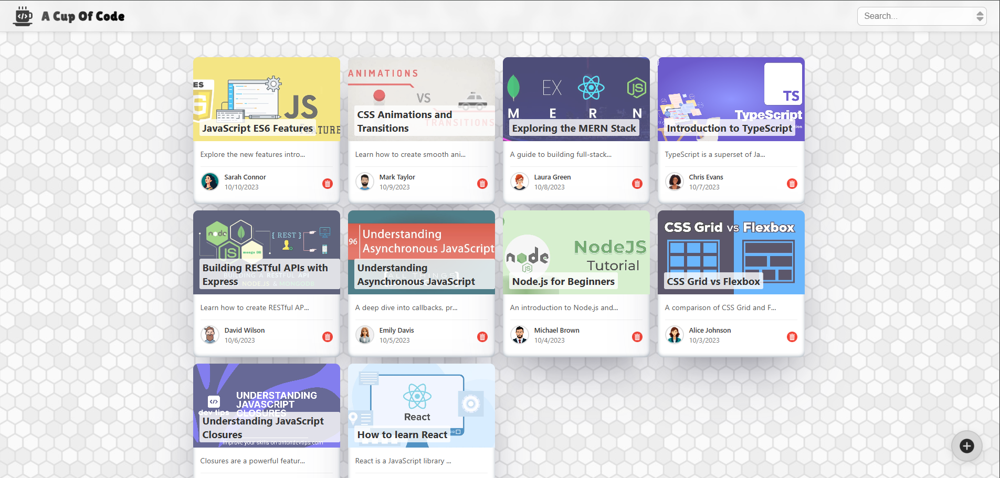
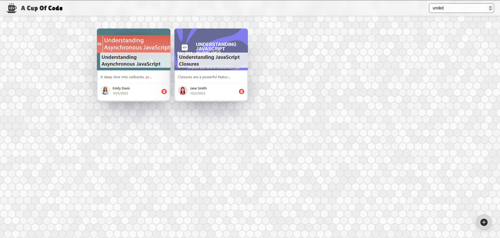
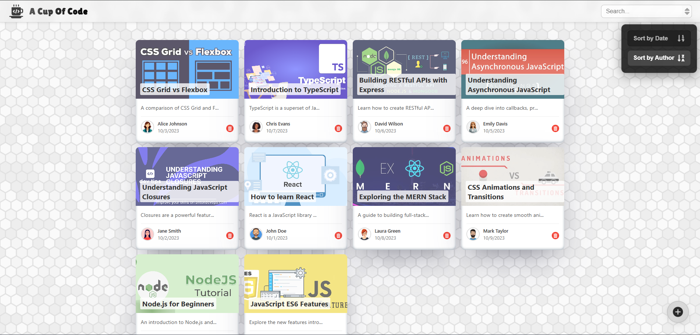
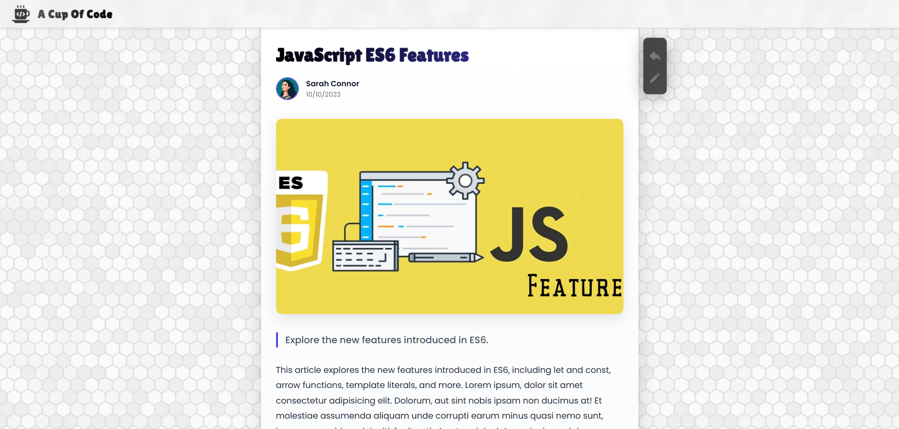

# ☕ A Cup Of Code

A Cup Of Code, basit ama şık bir blog uygulamasıdır. Kullanıcılar yeni postlar ekleyebilir, mevcut postları silebilir veya güncelleyebilir. Uygulama, React ile geliştirilmiş olup global state yönetimi için Context API kullanılmıştır. Tasarımı ise normal CSS ile responsive şekilde hazırlanmıştır.

## 🚀 Özellikler

- Post ekleme ✍️  
- Post güncelleme 📝  
- Post silme 🗑️  
- Context API ile global state yönetimi  
- Responsive ve sade kullanıcı arayüzü  
- Vanilla CSS ile tasarım

## 🛠️ Kullanılan Teknolojiler

- React
- Context API
- CSS (Vanilla)
- Responsive Design

## 📸 Ekran Görüntüleri

### Ana Sayfa

### Arama İşlemi

### Sıralama İşlemi

### Yeni Post Ekleme

### Blog Detay Sayfası

### Post Güncelleme

